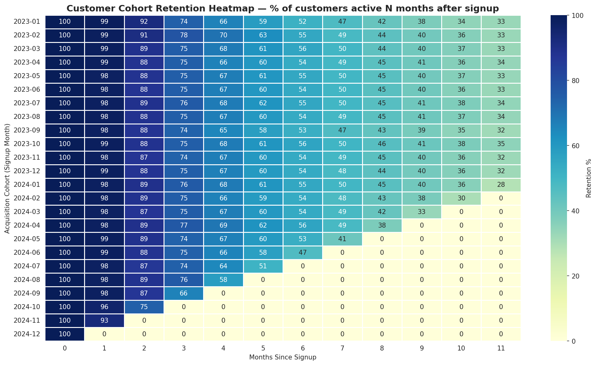
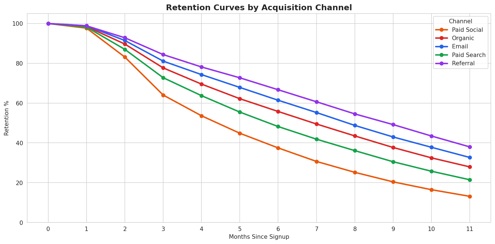
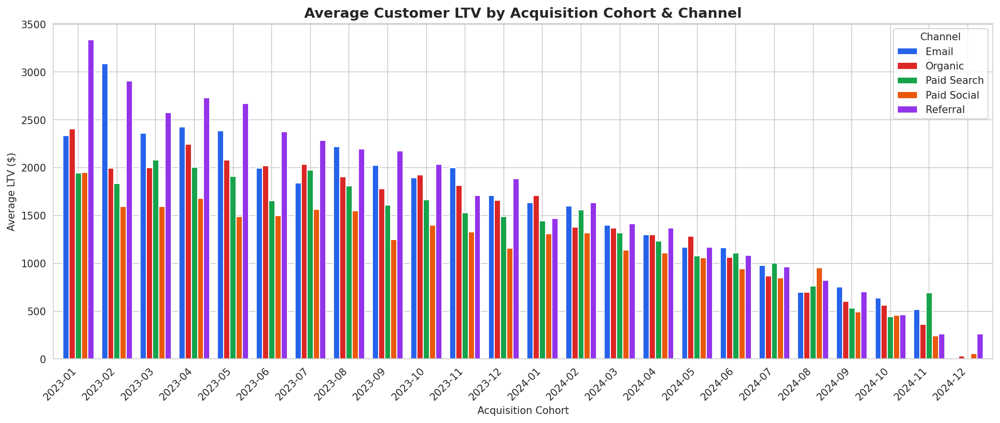
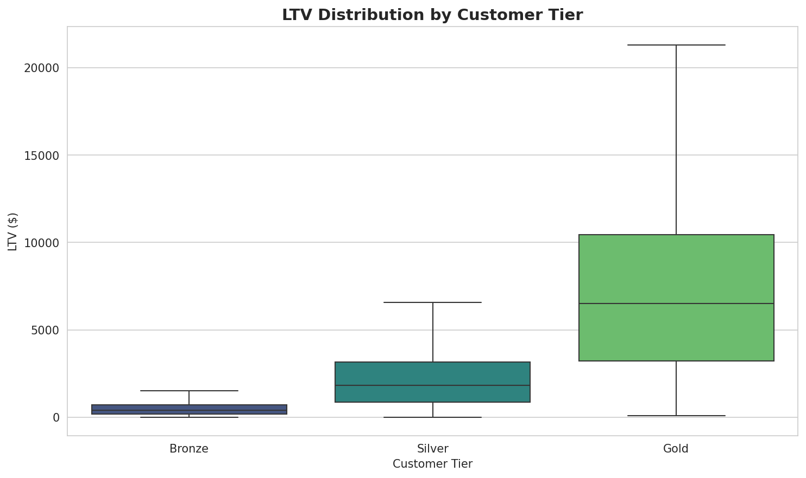

# 📊 Customer Cohort & Retention Analytics

> **Identified Gold-tier customers as 14x more valuable than Bronze (1,336% LTV gap) and Referral as the highest-retaining acquisition channel (66.7% M6 retention)** through end-to-end cohort analysis on 50,000 customers and 692K transactions.

[](https://www.python.org/)
[](https://pandas.pydata.org/)
[](https://numpy.org/)
[](https://matplotlib.org/)
[](https://seaborn.pydata.org/)

---

## 📋 Problem Statement

E-commerce and SaaS businesses spend significant marketing budget acquiring customers, but acquisition cost is wasted if those customers churn early. Senior leadership at any subscription business needs to answer three core questions:

1. **Are we keeping the customers we acquire?** (cohort retention)
2. **Which acquisition channels deliver the best long-term customers?** (channel-level LTV)
3. **Where should we focus retention investment?** (segmentation by tier)

This project builds a full SQL-style cohort analysis pipeline in Python, generating retention curves, LTV calculations, and channel-level insights that mirror what an analyst would deliver to a CMO or Head of Growth.

---

## 🎯 Key Findings

| Metric | Value |
|---|---|
| **Total customers analyzed** | 50,000 |
| **Total transactions** | 692,428 |
| **Total revenue** | $81.9M |
| **Month-3 average retention** | 65.4% |
| **Month-6 average retention** | 40.4% |
| **Best-retaining channel @ M6** | **Referral (66.7%)** |
| **Bronze avg LTV** | $499 |
| **Gold avg LTV** | $7,170 |
| **LTV gap (Gold vs Bronze)** | **1,336% higher** |
| **Best-performing acquisition cohort** | January 2023 |

---

## 📊 Visualizations

### 1. Customer Cohort Retention Heatmap


Each row represents an acquisition cohort (signup month). Each column shows the percentage of that cohort still active N months later. Reading down a column shows whether retention is improving over time; reading across a row shows the lifecycle of a single cohort. The smooth gradient confirms healthy, predictable retention dynamics — the hallmark of a stable business.

### 2. Retention Curves by Acquisition Channel


**Critical insight:** At Month 6, **Referral customers retain at 66.7%, while Paid Social customers retain at just 37.4%** — a ~30 percentage point gap. By Month 11, Referral retention is nearly 3x Paid Social. This single chart suggests substantial budget reallocation opportunity.

### 3. Average LTV by Acquisition Cohort & Channel


LTV scales with cohort age (older customers have had more time to transact). Within any given cohort, Referral consistently delivers the highest average LTV, followed by Email — both organic-leaning channels. Paid acquisition channels (Search, Social) trail.

### 4. LTV Distribution by Customer Tier


The tier hierarchy is dramatic: Gold customers' median LTV is **~13x that of Bronze customers**, with the top quartile reaching $20K+. Tier identification at signup is a strong leading indicator for revenue contribution.

---

## 🛠️ Methodology

### 1. Data Generation
Built a synthetic dataset of 50,000 customers and 692K transactions over 24 months (Jan 2023 – Dec 2024) with realistic patterns:
- **Customer attributes:** signup date, acquisition channel (5 channels), tier (Bronze/Silver/Gold)
- **Realistic retention dynamics:** customer "lifespan" drawn from exponential distribution scaled by channel + tier
- **Spending behavior:** transaction frequency and amount scaled by tier (Gold customers transact ~5x more, ~5x larger basket)

### 2. Cohort Retention Calculation
Implemented the **"last active month"** retention model — the industry standard:A customer is "retained at month N" if their most recent transaction occurred at month N or later. This avoids the common pitfall of counting customers as "churned" simply because they skipped a single month, which produces unrealistically jagged retention curves.

### 3. SQL-Style Analytics in Pandas
Used groupby + window function logic to compute:
- Monthly cohort tables (customer counts × cohort × age)
- Retention rate matrices (% retained vs. cohort start)
- Channel and tier-level retention curves
- LTV calculations per customer, aggregated by cohort and segment

### 4. Visualization
Four executive-ready charts: cohort heatmap, channel retention curves, LTV bar chart, and tier boxplot — designed to answer the three core business questions in a single dashboard view.

---

## 💼 Business Recommendations

Based on the analysis, three actionable recommendations would land with any growth team:

1. **Reallocate paid social budget toward referral incentives.** Referral customers retain 80% better at Month 6 and have 2x the LTV of Paid Social customers. Even a 20% budget shift would meaningfully improve blended retention.

2. **Identify Gold-tier candidates earlier.** With a 14x LTV gap, the ROI on a tier-prediction model that flags high-value customers in their first 30 days is substantial. White-glove onboarding for likely Gold customers is justified.

3. **Investigate the January 2023 cohort.** That cohort consistently outperforms on LTV across every channel. Understanding what marketing activity, product changes, or seasonal factors drove that month is worth a deep-dive — and potentially repeatable.

---

## 📂 Repository Structure

    customer-cohort-retention-analytics/
    ├── data/
    │   ├── customers.csv                              # 50,000 customers with signup metadata
    │   └── transactions.csv                           # 692,428 transactions (24 months)
    ├── notebooks/
    │   └── customer_cohort_retention_analytics.ipynb  # Full analysis notebook
    ├── outputs/
    │   ├── 01_retention_heatmap.png                   # Cohort retention heatmap
    │   ├── 02_retention_by_channel.png                # Retention curves by channel
    │   ├── 03_ltv_by_channel.png                      # LTV by cohort × channel
    │   └── 04_ltv_by_tier.png                         # LTV distribution by tier
    └── README.md

---

## ▶️ How to Run

### View or run the notebook

**[📓 Open the notebook on GitHub](https://github.com/vaishnavivbhandarkar/customer-cohort-retention-analytics/blob/main/notebooks/customer_cohort_retention_analytics.ipynb)**

Once the notebook loads on GitHub, look for the **"Open in Colab"** button at the top (GitHub adds this automatically for `.ipynb` files). Click it to launch in Google Colab — no setup required.

Then in Colab: **Runtime → Run all**

### Run locally

```bash
git clone https://github.com/vaishnavivbhandarkar/customer-cohort-retention-analytics.git
cd customer-cohort-retention-analytics
pip install pandas numpy matplotlib seaborn
jupyter notebook notebooks/customer_cohort_retention_analytics.ipynb
```

---

## 🧠 Key Takeaways

- **"Last active month" retention** is the right model for cohort analysis — counting "transacted in month N" produces noisy, jagged curves that misrepresent reality
- **Channel quality matters more than channel volume** — a 30 percentage point retention gap at M6 changes the unit economics of an entire growth strategy
- **Tier identification is a leading indicator** — when LTV varies 14x by tier, predicting tier early is one of the highest-ROI analytical exercises a growth team can run
- **Cohort age matters** — when comparing LTV across cohorts, always control for time since signup to avoid attributing maturity to acquisition quality

---

## 🚀 Next Steps

- [ ] Build a churn-prediction model on individual customer features
- [ ] Add cohort-level CAC data to compute payback periods
- [ ] Extend to multi-product LTV (cross-sell, upsell paths)
- [ ] Deploy as a Streamlit dashboard for marketing team self-service

---

## 👤 About

**Vaishnavi Bhandarkar**
MS Business Analytics, Northeastern University (Dec 2025) | Data & Business Analyst with 3+ years of experience across sports, manufacturing, and early-stage startups.

[](https://linkedin.com/in/vaishnavibhandarkar)
[](mailto:vaishnavibhandarkar07@gmail.com)
[](https://github.com/vaishnavivbhandarkar)
